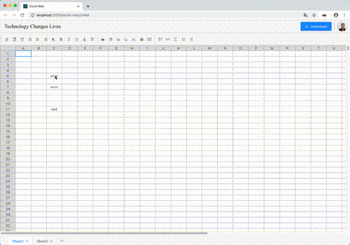

# Excel Web

## Description
This is a react web app,that implement excel base features.

You can preview features at [https://gaobowen.github.io/excel-web](https://gaobowen.github.io/excel-web/).

## Scripts

In the project directory, you can run:

### `npm start`

Runs the app in the development mode.Open [http://localhost:3000](http://localhost:3000) to view it in the browser.  
The page will reload if you make edits.You will also see any lint errors in the console.

## Features
### Simulate QRcode Login
Open your Alibaba Dingding App scan the QRcode.

### Github User Name Login
Type an available github username, press the enter key.

### Edit Cells & Sheets
- Type text in cells. 
- Add & Delete Sheet.  
- Drag In, Move, Scale & Delete Image.
- Optimizing table performance,  Support 100K cells operations 

### Download 
Download your sheets as .xslx file. And you can open it in MS Office.

## Future
More features will be added. 

